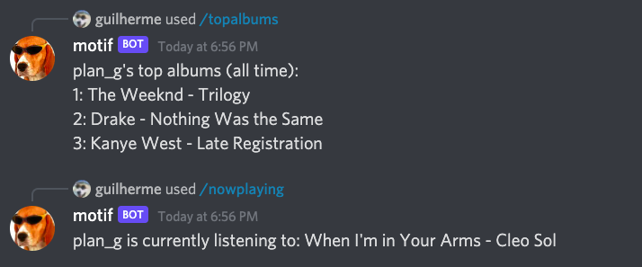

Bot for Discord that fetches data from [Last.fm].

## Prerequisites

- You must have [Node.js](https://nodejs.org) installed.

- You need a Last.fm API key, 
[create one here](http://www.last.fm/api/accounts). 

- You also need a Discord bot, 
[create one here](https://discord.com/developers/applications).

## Instructions

**Clone this repository**, then **install the dependencies** with 
```
npm i
```

Then, **create a `.env` file**, modeled after the existing `.example.env` file.

`TOKEN` will be your bot's token and 
`LASTFM_API_KEY` will be your Last.fm API key.
`CLIENT_ID` will be your bot's client ID and
`GUILD_ID` will be your server's guild ID. 

Then, **add your bot to a Discord server**: there are several 
resources online where you can learn how to do this.

Then, **register its slash commands** in your server with 
```
npm run deploy
```

Now, **run the bot** whenever you want with
```
npm start
```
If everything went well, you should see `Logged in as [bot username]!` in the terminal. 

## Commands

<p align="center">
  
</p>

The bot currently has 2 commands:

### `/nowplaying [user]`

Returns the last song [scrobbled] by `user` (must be a Last.fm account).

### `/topalbums [user]`

Returns the top 3 albums (all time) [scrobbled] by `user` (must be a Last.fm account).

[last.fm]: http://www.last.fm/
[scrobbled]: https://www.netlingo.com/word/scrobble.php
